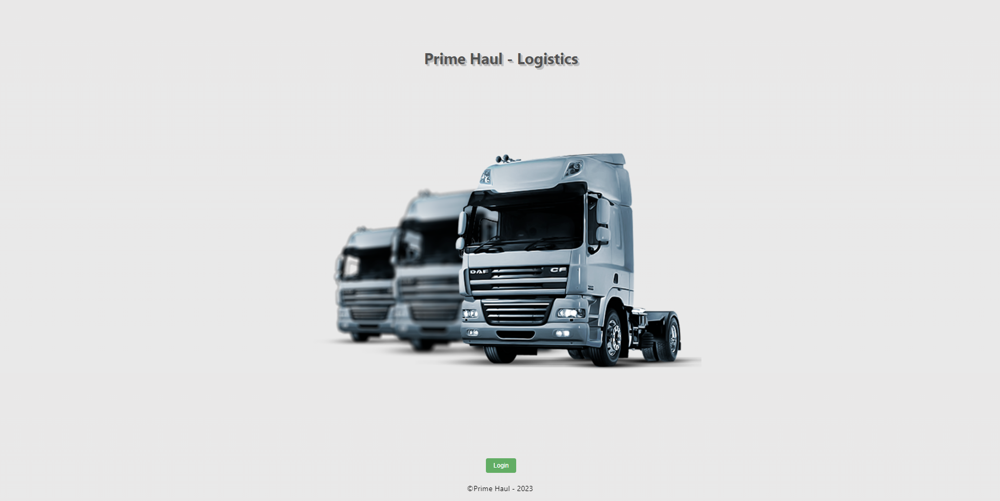
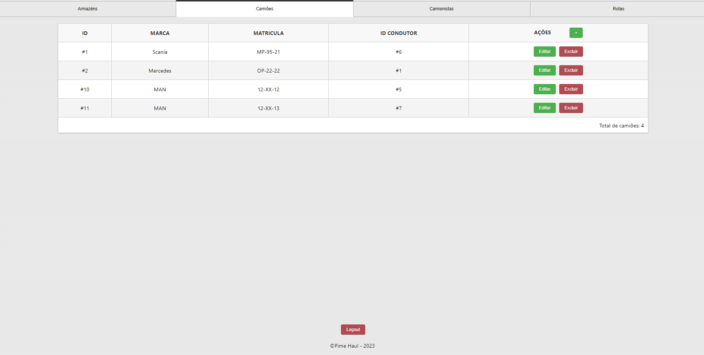
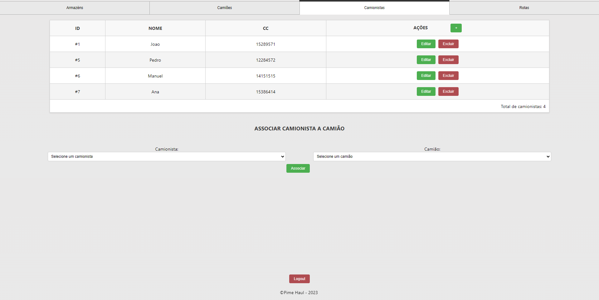
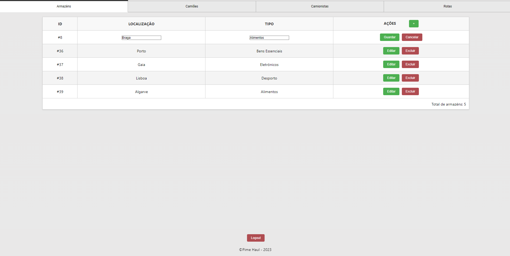
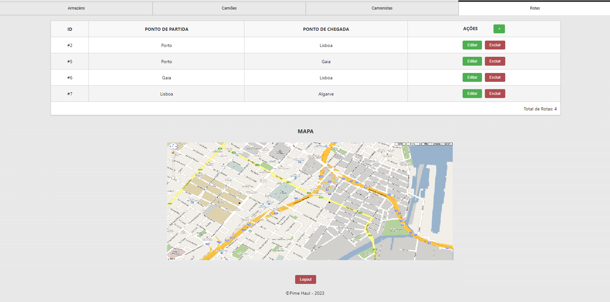

# Transportadora

Este repositório serve para alojar o projeto, da cadeira de Desenvolvimento Web 2, da Universidade da Maia.

## Descrição

Este projeto pretende auxiliar uma empresa de logística na sua gestão de frotas de camiões, camionistas, rotas e armazéns. Através de uma inteface intuitiva é possível adicionar, remover e editar todos estes componentes da empresa. Também rapidamente é possível observar a lista de todos os ativos disponíveis e observar por qual camião cada camionista está responsável no momento. Para tal é necessário associar cada camião a um camionista. A função de observação no mapa, em tempo real, de todos os camiões está em fase beta.

## Galeria

| Página      | Imagem |
| ----------- | ----------- |
| Página Ínicial      |        |
| Página Camiões   |        |
| Página Camionistas  |        |
| Página Armazéns      |        |
| Página Rotas   |        |

## Tecnologias

* [XML](https://www.w3.org/XML/)
* [HTML5](https://html.spec.whatwg.org/multipage/) + [CSS3](https://www.w3.org/Style/CSS/)
* [Javascript](https://developer.mozilla.org/en-US/docs/Learn/JavaScript)
* [PHP](https://www.php.net/)
* [nodeJS](https://nodejs.org/en/)

### Frameworks and Libraries

* Docker
* NodeJS
* ReactJS

### Apresentação do Projeto
* Chapter 1: [Project presentation](doc/c1.md)
### Recursos
* Chapter 2: [Resources](doc/c2.md)
### Produto
* Chapter 3: [Product](doc/c3.md)
### Apresentação
* Chapter 4: [Presentation](doc/c4.md)

## Team
* Diogo Gomes [@DiogoGomes](https://github.com/diogogomes-pt)
* David Brito [@DavidBrito](https://github.com/DavidBrito12)
* Gonçalo Ramos [@GonçaloRamos](https://github.com/Goncalo08)
